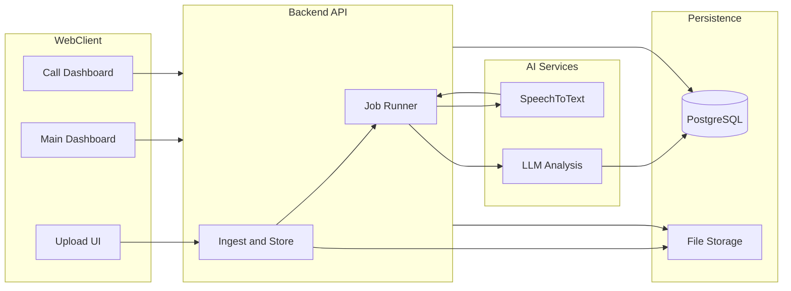

# CP Prompt-X — Project Plan (Call Intelligence Platform)

**Purpose:** Hackathon / product plan document: scope, architecture, data model, API, UI, phases, risks, and success criteria.

**As implemented (this repo):** Single **React + Vite** app with **IndexedDB (Dexie)** for persistence and **Groq** (via dev proxy) for STT + chat. The original plan below also described **FastAPI + PostgreSQL** and **OpenAI**; those were valid alternatives—the **functional requirements and UX** match this document even where the stack differs.

---

## 1. Requirements synthesis

### 1.1 Pipeline

Upload audio → transcribe (text + timestamps) → speaker attribution / talk-time → LLM analysis → stored insights → dashboards.

### 1.2 Main dashboard (managers)

- Total calls processed  
- Sentiment split (positive / neutral / negative)  
- Average call score (0–10)  
- Average duration  
- Top keywords across all calls  
- Total action items  

### 1.3 Per-call dashboard

- AI summary  
- Overall sentiment  
- Audio player with **synced transcript**  
- **Talk-time %** (agent vs customer)  
- **Overall score** (0–10)  
- **Five dimension scores** (1–10 each): communication clarity, politeness, business knowledge, problem handling, listening  
- **Questionnaire coverage** (predefined discovery topics → asked yes/no + count)  
- **Top keywords** for that call  
- **Follow-up action items**  
- **Positive / negative observations**  

### 1.4 Optional stretch

Discovery quality (extract agent questions), sentiment over time (segments), richer diarization if STT supports it.

---

## 2. Recommended stack (original plan)

| Layer | Original recommendation | Rationale |
|-------|-------------------------|-----------|
| Monorepo | Single repo | One PR flow; shared types |
| Backend | Node (Fastify/Express) or **Python (FastAPI)** | API + jobs; Python handy for ffmpeg/Whisper CLI |
| Database | **PostgreSQL** + ORM/migrations | Relational model for calls, segments, analyses |
| File storage | Local disk MVP → S3/R2 | Simple first milestone |
| STT | OpenAI Whisper API or Deepgram | Timestamps; optional diarization |
| Analysis | OpenAI / Anthropic chat, **strict JSON** | Scores, questionnaire, keywords, actions |
| Frontend | **React + Vite** + TanStack Query + charts | Dashboards + detail |

**No paid APIs:** Local Whisper + Ollama possible; expect more tuning and JSON repair/retry.

**Current repo:** No separate DB server—**IndexedDB** holds calls/segments/analyses/audio; **Groq** replaces OpenAI for STT/chat in code paths under `src/lib/`.

---

## 3. High-level architecture

**As implemented:** Client holds data in **IndexedDB**; “API” for AI is **proxied Groq** (`/api/transcribe`, `/api/chat`) from the Vite dev server—no separate ingest service process.

---

## 4. Data model (logical)

Version analyses so re-runs do not lose history.

### 4.1 Call

- `id`, `original_filename`, `stored_path` (or blob ref), `duration_sec`  
- `status`: `uploaded` | `transcribing` | `analyzing` | `ready` | `failed`  
- `created_at`, optional `error_message`  
- Denormalized (optional): latest sentiment / score for list views  

### 4.2 TranscriptSegment

- `call_id`, `start_ms`, `end_ms`  
- `speaker_label`: `agent` | `customer` | `unknown`  
- `text` — drives transcript sync + talk time  

### 4.3 CallAnalysis (per run)

- `overall_sentiment`, `overall_score_0_10`, `summary_text`  
- `agent_talk_pct`, `customer_talk_pct`  
- `dimension_scores` (JSON/object)  
- `questionnaire_results` (topic id → covered bool)  
- `keywords`, `action_items`, `observations_pos`, `observations_neg`  
- Optional `evidence`, `raw_llm_response`, `model_name`, `created_at`  

### 4.4 Questionnaire (seed)

Topics with `topic_id`, `topic_label`, `match_hints`. LLM returns coverage; not only keyword matching.

---

## 5. Processing pipeline (modular steps)

1. **Upload** — Validate file → store → create call record.  
2. **Transcribe** — STT → segments with timestamps. If no diarization, **LLM speaker pass** on segments (demo) or `unknown` + estimated talk time.  
3. **Talk time** — Sum duration by speaker → percentages.  
4. **Analyze** — Prompt with transcript + questionnaire → **strict JSON**; validate; retry with “fix JSON” if needed.  
5. **Aggregate** — Dashboard metrics over **ready** calls + latest analysis (or equivalent in IndexedDB).  

---

## 6. API surface (minimal — server-backed variant)

When using a dedicated backend:

| Method | Path | Purpose |
|--------|------|---------|
| POST | `/api/calls` | Create + upload; returns `call_id` |
| POST | `/api/calls/:id/process` | Re-run pipeline |
| GET | `/api/calls` | List with status + summary |
| GET | `/api/calls/:id` | Detail: segments, analysis, audio URL |
| GET | `/api/calls/:id/audio` | Stream audio (`Content-Type`, `Accept-Ranges`) |
| GET | `/api/dashboard/summary` | Aggregates + top keywords |
| GET | `/api/questionnaire/topics` | Checklist labels (optional) |

**Current app:** Same **UI contracts**; persistence and processing run in the **browser**; AI uses **Groq proxy** routes above the SPA.

---

## 7. Frontend pages

1. **Calls / upload** — Upload, table, status badges, link to detail.  
2. **Main dashboard** — Metric cards; sentiment chart; top keywords.  
3. **Call detail** — Summary, sentiment, scores, dimensions, questionnaire table, keyword chips, actions, observations, **audio + synced transcript** (highlight segment by `currentTime`).  

**Synced transcript:** On `timeupdate`, active segment where `start_ms <= t*1000 < end_ms`.

---

## 8. Execution phases (original checklist)

| # | Phase | Outcome |
|---|--------|---------|
| 1 | Scaffold | Repo layout, env example, optional Docker Postgres |
| 2 | DB + models | Migrations; seed questionnaire |
| 3 | Upload + list | End-to-end file path |
| 4 | STT | Segments persisted; transcript in API |
| 5 | LLM analysis | Structured output → analysis record; call `ready` |
| 6 | Dashboard API | Aggregations |
| 7 | UI | Dashboard + detail + audio sync |
| 8 | Polish | Errors, reprocess, demo seed |

---

## 9. Risks and mitigations

| Risk | Mitigation |
|------|------------|
| Long transcripts / token limits | Chunk → analyze → merge (second pass for scores + questionnaire) |
| Weak / no diarization | Label talk time “estimated”; prefer STT with diarization if available |
| Hallucinated scores | Evidence quotes per dimension in JSON; tooltips in UI |

---

## 10. Success criteria (hackathon demo)

- Upload at least one sample recording → status progresses to **ready**.  
- **Main dashboard** shows plausible aggregates after several calls.  
- **Call detail:** transcript sync with audio, questionnaire, scores, keywords, actions, observations.  

---

## 11. Export this document

| Format | How |
|--------|-----|
| **PDF** | Open [`PROJECT_PLAN.html`](./PROJECT_PLAN.html) in a browser → Print → Save as PDF |
| **Word** | Open this `.md` in Word and Save as `.docx`, or `pandoc docs/PROJECT_PLAN.md -o docs/PROJECT_PLAN.docx` |

---

*Derived from the CP Prompt-X Call Intelligence MVP plan. Technical prompt text is documented separately in [`PROMPT_LOG.md`](./PROMPT_LOG.md).*
